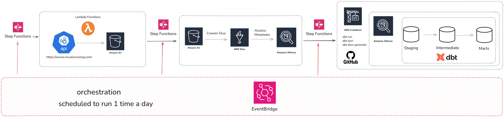
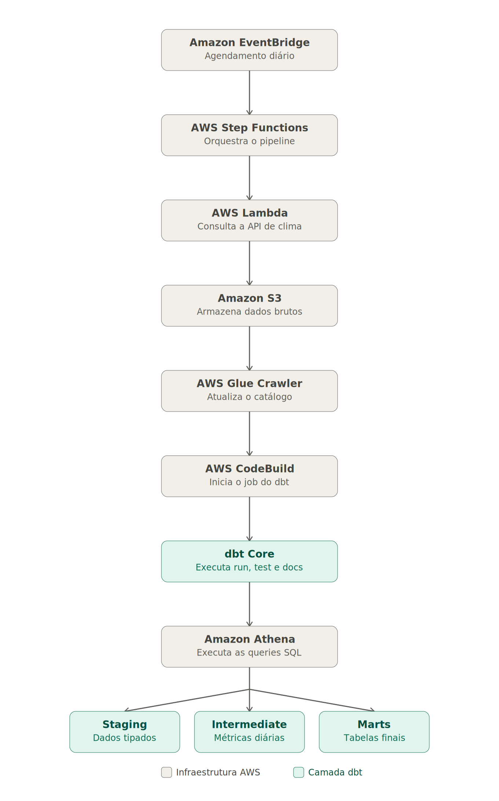
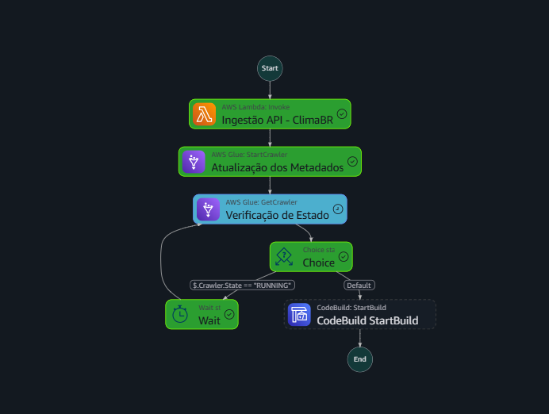
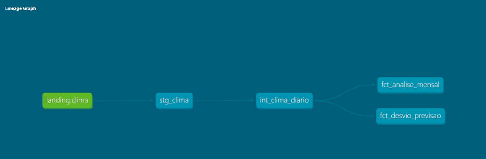

# 🌦️ ClimaBR

Um pipeline moderno de Engenharia de Dados desenvolvido na AWS para ingestão, catalogação, transformação e disponibilização de dados climáticos das 27 capitais brasileiras.

O projeto utiliza uma arquitetura **serverless**, onde os dados são coletados automaticamente da API Visual Crossing, armazenados no Amazon S3 e transformados utilizando **dbt Core** sobre o Amazon Athena.

---

# 📖 Objetivo

O ClimaBR foi desenvolvido com o objetivo de demonstrar a implementação completa de um pipeline de dados em ambiente cloud utilizando serviços gerenciados da AWS e boas práticas de Analytics Engineering.

O pipeline automatiza todo o fluxo de ingestão e transformação dos dados, produzindo modelos analíticos organizados em camadas para facilitar análises e consumo por ferramentas de BI.

---

# 🏗️ Arquitetura

<p align="center">
    
</p>

<p align="center">
    
</p>
Fluxo de execução:

```text
Amazon EventBridge
        │
        ▼
AWS Step Functions
        │
        ▼
AWS Lambda
        │
        ▼
Visual Crossing Weather API
        │
        ▼
Amazon S3
        │
        ▼
AWS Glue Crawler
        │
        ▼
AWS Glue Data Catalog
        │
        ▼
AWS CodeBuild
        │
        ▼
dbt Core
        │
        ▼
Amazon Athena
        │
        ▼
Staging
        │
Intermediate
        │
Marts
```


# WorkFlow - Step Functions

<p align="center">
    
</p>

<p align="center">
    
</p>


---

# 🚀 Tecnologias Utilizadas

| Tecnologia | Finalidade |
|------------|------------|
| Python | Coleta dos dados |
| AWS Lambda | Execução da ingestão |
| Amazon S3 | Armazenamento dos arquivos JSON |
| AWS Glue | Catálogo de dados |
| Amazon Athena | Engine SQL |
| dbt Core | Transformação dos dados |
| AWS Step Functions | Orquestração |
| Amazon EventBridge | Agendamento automático |
| AWS CodeBuild | Execução automatizada do dbt |
| Git & GitHub | Versionamento |

---

# ⚙️ Pipeline

A execução ocorre diariamente seguindo as etapas abaixo.

1. O **Amazon EventBridge** inicia o fluxo em um horário programado.

2. O **AWS Step Functions** coordena todas as etapas do pipeline.

3. A função **AWS Lambda** consulta a API Visual Crossing para cada uma das 27 capitais brasileiras.

4. Os arquivos JSON são armazenados no **Amazon S3** utilizando particionamento por data.

5. O **AWS Glue Crawler** atualiza automaticamente o catálogo de metadados.

6. O **AWS CodeBuild** executa o projeto dbt.

7. O dbt envia as consultas SQL para o **Amazon Athena**, responsável por criar e atualizar as views e tabelas analíticas.

---

# 📂 Estrutura do Projeto

```
ClimaBR
│
├── models
│   ├── staging
│   │   └── stg_clima.sql
│   │
│   ├── intermediate
│   │   └── int_clima_diario.sql
│   │
│   └── marts
│       ├── fct_analise_mensal.sql
│       └── fct_desvio_previsao.sql
│
├── macros
├── tests
├── seeds
├── snapshots
├── analyses
├── dbt_project.yml
├── packages.yml
└── README.md
```

---

# 🧩 Camadas de Transformação

## Staging

Primeira camada responsável pela limpeza e padronização dos dados provenientes da API.

Modelo:

- `stg_clima`

---

## Intermediate

Camada destinada ao enriquecimento dos dados e aplicação das regras de negócio intermediárias.

Modelo:

- `int_clima_diario`

---

## Marts

Camada final destinada ao consumo analítico.

Modelos:

- `fct_analise_mensal`
- `fct_desvio_previsao`

---

# ✅ Qualidade dos Dados

O projeto utiliza testes automatizados do dbt para garantir a consistência dos dados.

Entre as validações implementadas estão:

- Valores nulos
- Intervalos válidos
- Integridade dos dados
- Regras de negócio
- Testes utilizando **dbt_expectations**

---

# 📚 Documentação

Toda a documentação é gerada automaticamente pelo dbt.

```bash
dbt docs generate
dbt docs serve
```

A documentação disponibiliza:

- Lineage Graph dos modelos
- Sources
- Models
- Colunas
- Testes
- Macros
- Descrições

## Lineage Graph

Abaixo, o grafo de linhagem gerado pelo `dbt docs`, mostrando a dependência entre a fonte (`landing.clima`) e os modelos de `staging`, `intermediate` e `marts`:

<p align="center">
    
</p>

---

# ▶️ Como Executar

Clone o repositório.

```bash
git clone https://github.com/JjesusCrz/ClimaBR.git
```

Crie um ambiente virtual.

```bash
python -m venv .venv
```

Ative o ambiente.

Windows

```bash
.venv\Scripts\activate
```

Linux

```bash
source .venv/bin/activate
```

Instale as dependências.

```bash
pip install -r requirements.txt
```

Instale os pacotes do dbt.

```bash
dbt deps
```

Execute as transformações.

```bash
dbt run
```

Execute os testes.

```bash
dbt test
```

Gere a documentação.

```bash
dbt docs generate
```

---

# 📈 Fonte dos Dados

Todos os dados são obtidos através da API pública da Visual Crossing Weather.

https://www.visualcrossing.com/

---

# 🔮 Possíveis Próximas Evoluções

- Containerização com Docker
- Orquestração utilizando Apache Airflow
- Infraestrutura como código com Terraform
- CI/CD utilizando GitHub Actions
- Monitoramento do pipeline
- Ambiente multi-cloud

---

# 👨‍💻 Autor

## Joel de Jesus da Cruz

Engenheiro de Dados em formação, com foco em desenvolvimento de pipelines de dados, Analytics Engineering e computação em nuvem.

### Contato

**LinkedIn**

https://www.linkedin.com/in/joel-cruz-444976247/

**GitHub**

https://github.com/JjesusCrz
